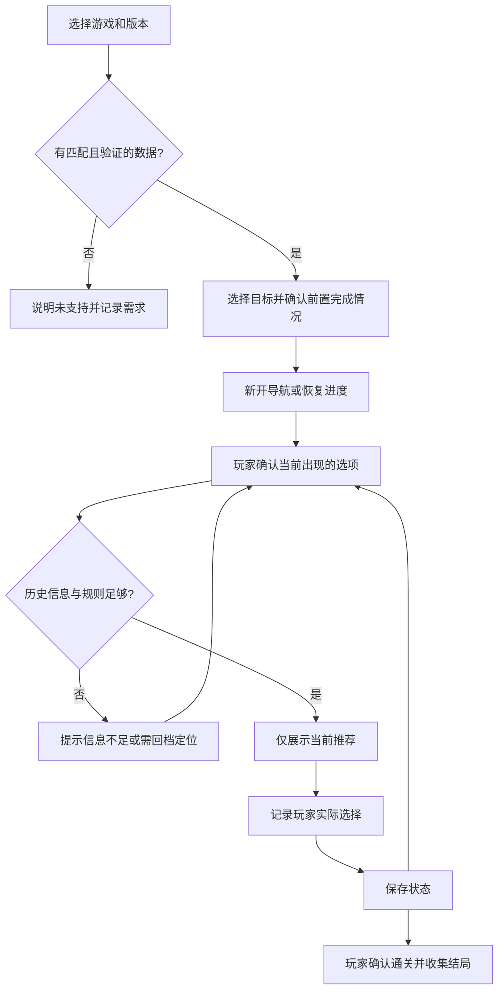

> 2026-09-15 当前实现调整：用户流程为「作品 → 篇章 → 目标结局 → 路线树」。完整目标选项默认可见，不再设置“遇到选项才展开”的门槛，不使用含义不清的“推荐”文案。进度记录可选。工作台及录入入口暂时移除。以下早期规划中与此冲突的内容暂不适用。

# V0.1 产品与用户流程

## 定位

面向正在玩 Galgame 的中文用户：选定目标后，在遇到选项时得到当前需要的提示，并保留自己的游玩记录。核心价值是减少查长攻略时意外看到后续剧情的机会。

## 首轮范围

| 优先级 | 功能                         | 验收                                                           |
| ------ | ---------------------------- | -------------------------------------------------------------- |
| P0     | 游戏、中文别名搜索和版本选择 | 同名不同版本不混用路线；缺失版本明确显示不支持                 |
| P0     | 选择目标路线                 | 有前置要求时先确认，隐藏未解锁结局细节                         |
| P0     | 当前选项定位                 | 用户主动确认当前节点；重名文本需额外定位，不自动猜测           |
| P0     | 无剧透推荐                   | 默认只显示当前选项和推荐；原因、未来节点、隐藏结局不渲染到界面 |
| P0     | 记录、恢复、撤销             | 确认选择后保存；重新打开继续；撤销后重新计算状态               |
| P0     | 偏离与信息不足处理           | 历史不完整或规则不匹配时返回未知并帮助重新定位                 |
| P0     | 结局记录                     | 玩家确认到达后记录；导航走完不自动视为通关                     |
| P0     | 维护者录入与审核             | 先采用文件录入加自动检查；发布前人工验证                       |
| P1     | 备份导出与导入               | 本地进度可恢复；导入前校验数据版本                             |

首轮不包含社交、自动读游戏存档、OCR、AI 自动生成攻略、海量抓取、付费订阅、排行榜、云账户和完整攻略编辑器。后续是否做，由验证结果决定。

## 用户流程

## 无剧透边界

- 默认不展示路线效果、隐藏 Flag、好感度、未到达节点文本及结局名称。
- 原因属于单独的显式展开操作；搜索摘要、通知、错误提示和可访问性文本遵守相同规则。
- “已记录 4 个关键选择”可以准确展示；不将节点比例包装成剧情进度，也不虚构命中路线概率。
- 无剧透指正常产品界面的展示控制，不承诺阻止用户检查离线数据包。
- 已选错误选项必须如实记录，不自动改为推荐选项；确认回档后再撤销受影响历史。

## 试用计划

先做一条有来源、可复现的路线，再邀请约 5～10 名正在游玩的玩家进行一轮测试。观察能否独立完成定位、是否遭遇意外剧透、保存后能否恢复、再次游玩是否继续使用。人数是计划，不是已有用户。

测试任务：首次开始导航、关闭后恢复、选错后回档、同名选项定位、版本不匹配、未满足前置条件、完成记录。每项记录成功/失败及原因；不预设虚假的行业留存基准。

宣传准备：真实导航录屏和具体查选项场景文案；渠道候选为现有玩家群、论坛和 B 站。当前不对外发消息、不发布宣传内容。通关卡片和年度报告放在核心体验得到验证之后。
